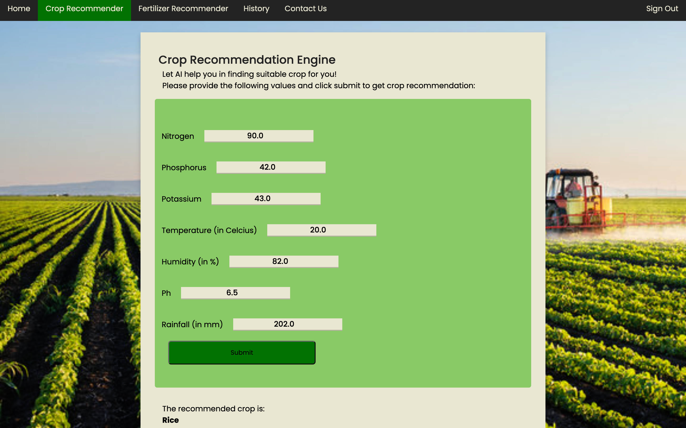
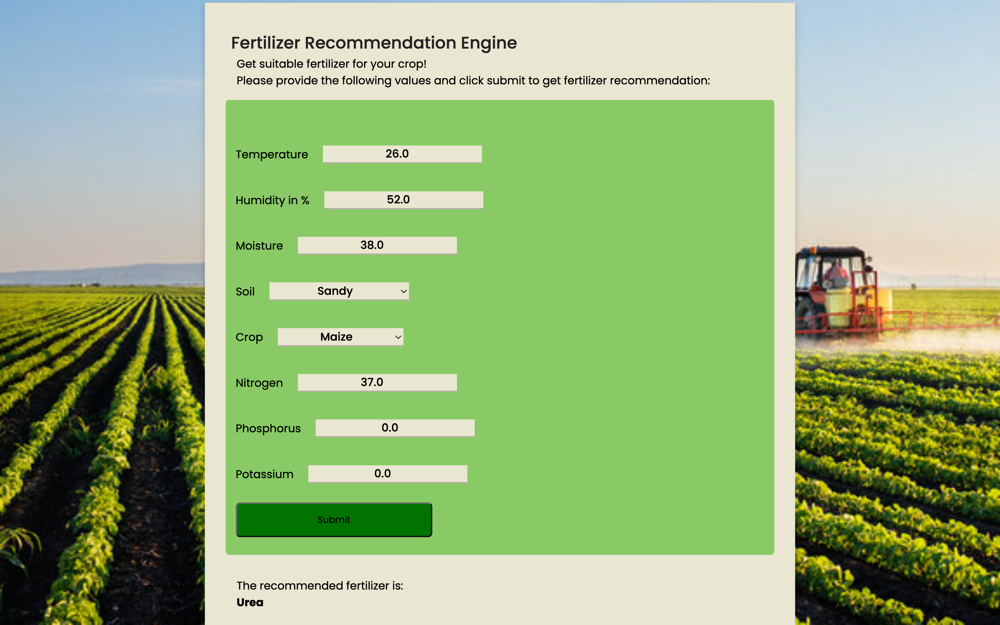
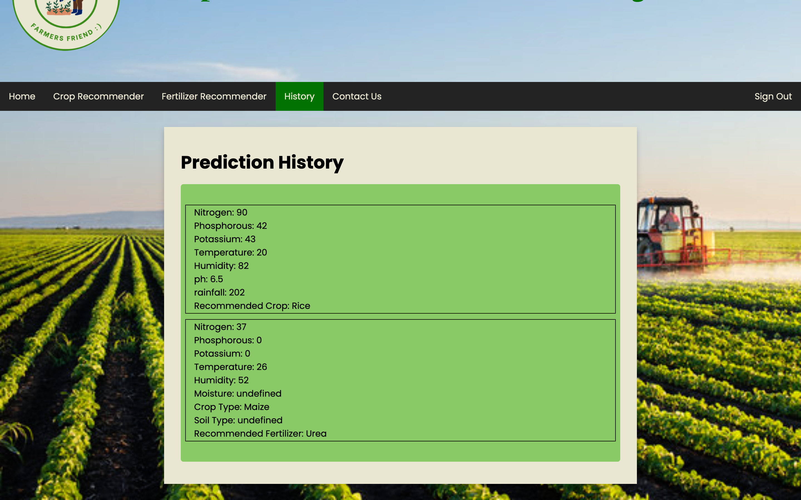

To install the  dependencies for CFRE app please follow the steps below:

1. python3 -m venv venv
2. pip install -r requirements.txt

To run the CFRE web app follow the steps below:
1. cd ml_server
2. python server.py
3. Open a new terminal at CFREWebapp
4. python run.py

Click the local host link displayed in the python terminal to access the web application.

Login Page
 

 
 
Signup Page
 

 
 
Home Page
 

 
 
Crop Recommendation Engine
 

 
 
Fertiliser Recommendation Engine
 

 
 
History
 

